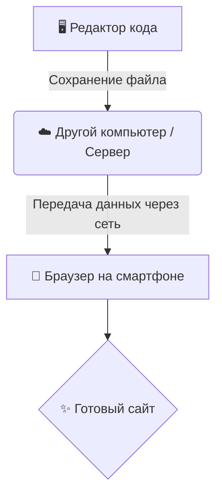

#### Для запуска нажми здесь:
https://developer-software.ru/editor.html

А так же можно просто скачать файл **editor.html** на ПК или смартфон и запускать его без интернета.

### Стартовый код: Привет, мир!

```
<!DOCTYPE html>
<html lang="ru">
  <head>
    <meta charset="utf-8">
    <style>
      body { text-align: center; padding-top: 20px; }
      h1 { color: blue; } 
      button { background-color: gold; }
    </style>
  </head>
  <body>

    <h1>Привет!</h1>
    <p>Начни менять код.</p>
    <button onclick="showMessage()">Моя кнопка</button>
    
    <script>
      function showMessage() {
        alert('Привет, мир!');
      }
    </script>

  </body>
</html>
```


------

## 📝 Разбор кода по полочкам

### 1. Структура документа (первые 2 строки)

```
<!DOCTYPE html>  - тег одиночка
<html lang="ru"> ... </html> - парный тег
```
`<!DOCTYPE html>` — это специальная инструкция (объявление типа документа), не являющаяся парным тегом. В свою очередь, `<html>` — это основной парный тег, который открывает HTML-документ и закрывается с помощью `</html>`, оборачивая всё содержимое страницы. 

- **`<!DOCTYPE html>` (одиночный):** Объявляет стандарт HTML5, не требует закрывающего тега и пишется в самой первой строке.
- **`<html lang="ru"> ... </html>` (парный):** Основной контейнер. Он открывается с указанием языка (`lang="ru"` — русский) и закрывается в самом конце файла.

Парные теги содержат в себе контент или другие элементы, тогда как одиночные (как `<!DOCTYPE>`, `<meta>`, ``) используются для вставки элементов или инструкций. 

------

### 2. Шапка страницы (`<head>`... `</head>`)

```
<head>
  <meta charset="utf-8">
  <style> ... </style>
</head>
```

- `<meta charset="utf-8">` — чтобы русские буквы отображались корректно
- `<style>` — здесь живут CSS-правила (внешний вид страницы)

------

### 3. Стили (внутри `<style>`...`</style>`)

```
body { 
  text-align: center;    /* всё по центру */
  padding-top: 20px;     /* отступ сверху 20 пикселей */
}

h1 { 
  color: blue;           /* заголовок синим */
}

button { 
  background-color: gold; /* кнопка золотая */
}
```


---

### 4. Тело страницы (`<body>`...`</body>`)

```
<h1>Привет!</h1>                    <!-- Самый главный заголовок -->
<p>Начни менять код.</p>             <!-- Обычный абзац -->
<button onclick="showMessage()">     <!-- Кнопка, которая вызывает функцию -->
  Моя кнопка
</button>
```


---

### 5. Тег для программы на JavaScript (`<script>`...`<script>`)

```
<script>
  function showMessage() {           // Объявляем функцию
    alert('Привет, мир!');           // Показываем всплывающее окно
  }
</script>
```

- `<script>` — тег для JavaScript кода

- `function showMessage()` — создаём функцию с именем

- `alert()` — команда, показывающая окошко с сообщением

------

## 🎯 **Как это работает вместе:**

1. Ты **кликаешь по кнопке**
2. Срабатывает `onclick="showMessage()"`
3. Запускается функция `showMessage()` из `<script>`
4. Появляется **alert** с текстом "Привет, мир!"

---

**Попробуй:**

- Поменяй текст в alert на свой
- Измени цвет `h1` с `blue` на `red`
- Добавь ещё одну кнопку

Хочешь, чтобы кнопка делала что-то ещё? Можем добавить счётчик кликов или менять текст на странице! 

---

```
<!DOCTYPE html>
<html lang="ru">
  <head>
    <meta charset="utf-8">
    <style>
      body { text-align: center; padding-top: 20px; }
      h1 { color: blue; }
      button { background-color: gold; }
    </style>
  </head>
  <body>

    <h1>Привет!</h1>
    <p>Начни менять код.</p>
    <div>
      <p>Кнопка нажата <span id="counter">0</span> раз(а)</p>
      <button onclick="incrementCounter()">Нажми меня</button>
    </div>

    <script>
      let count = 0;
      function incrementCounter() {
        count++;
        document.getElementById('counter').textContent = count;
      }
    </script>

  </body>
</html>
```
## 📝 Разбор изменений кода

### 1. Структура документа (первые 2 строки)

```
<!DOCTYPE html>
<html lang="ru">
```

- без изменений

------

### 2. Шапка страницы (`<head>` ...`</head>`)

```
  <head>
    <meta charset="utf-8">
    <style>
    ...
    </style>
  </head>
```

- без изменений

------

### 3. Стили (CSS внутри `<style>`... `</style>`)

```
      body { text-align: center; padding-top: 20px; }
      h1 { color: blue; }
      button { background-color: gold; }
```

- без изменений

------

### 4. Тело страницы (`<body>`...`</body>`) — видимая часть

```
<h1>Привет!</h1>
```

- Самый главный заголовок на странице (должен быть один)
- без изменений

```
<p>Начни менять код.</p>
```

- Обычный абзац с текстом
- без изменений

```
<div>
  <p>Кнопка нажата <span id="counter">0</span> раз(а)</p>
  <button onclick="incrementCounter()">Нажми меня</button>
</div>
```

### 5. Добавляем следующие изменения:

- `<div>` ... `</div>`— блок-контейнер для группировки элементов
- `<p>` ...`</p>` — абзац с текстом и встроенным счётчиком
- `<span id="counter">0</span>` — строчный элемент с **уникальным идентификатором** `id="counter"`, внутри которого число `0` (начальное значение счётчика)
- `<button onclick="incrementCounter()">` ... `</button>` — кнопка, при клике вызывает функцию `incrementCounter()`

------

### 6. Изменяем JavaScript (внутри `<script>`...`</script>`)

```
let count = 0;  // создаём переменную-счётчик и присваиваем ей значение 0

function incrementCounter() {     // объявляем функцию
  count++;                        // увеличиваем счётчик на 1 (count = count + 1)
  document.getElementById('counter').textContent = count;  // находим элемент с id="counter" и меняем его текст на новое значение count
}
```

## 🎯 **Как это работает по шагам:**

1. **Страница загружается**
   - Видим заголовок, текст, счётчик "0" и золотую кнопку
2. **Пользователь нажимает кнопку**
   - Срабатывает `onclick="incrementCounter()"`
3. **Запускается функция `incrementCounter()`**
   - `count++` — переменная `count` увеличивается на 1 (была 0 → стала 1)
   - `document.getElementById('counter')` — находит элемент с `id="counter"` (тот самый `<span>`)
   - `.textContent = count` — меняет текст внутри этого span на новое значение (1)
4. **Результат**
   - Текст "Кнопка нажата 0 раз(а)" превращается в "Кнопка нажата 1 раз(а)"
   - При каждом новом клике число растёт

------

## 📊 **Связь между частями:**

| Что делает      | Где находится                  | Как связано             |
| --------------- | ------------------------------ | ----------------------- |
| Показывает счёт | `<span id="counter">`          | JavaScript ищет этот ID |
| Ловит клик      | `onclick="incrementCounter()"` | Атрибут кнопки          |
| Считает         | `let count`                    | Переменная в памяти     |
| Обновляет экран | `document.getElementById(...)` | JavaScript меняет HTML  |

------

## 🎨 **Можно поиграть:**

| Что изменить       | Где                                | На что                    |
| ------------------ | ---------------------------------- | ------------------------- |
| Цвет заголовка     | В `<style>`: `h1 { color: blue; }` | `red`, `green`, `hotpink` |
| Текст кнопки       | В `<button>`                       | "Тыкни меня", "++"        |
| Начальное значение | `let count = 0;`                   | `let count = 10;`         |
| Шаг увеличения     | `count++`                          | `count = count + 2;`      |

------

**Хочешь, добавим:**

- Кнопку сброса счётчика?
- Чтобы цвет менялся после 10 кликов?
- Анимацию при нажатии?

Просто скажи! 😊

------

## 🆚 **Парные vs Одиночные теги**

### **1. Парные теги (с открывающим и закрывающим)**

Эти теги работают как **контейнеры** — они что-то обрамляют.

**Формат:** `<тег>содержимое</тег>`

**Примеры из твоего кода:**

```
<html>...</html>              <!-- внутри весь документ -->
<head>...</head>              <!-- внутри метаданные и стили -->
<style>...</style>            <!-- внутри CSS-правила -->
<body>...</body>              <!-- внутри видимая часть -->
<h1>Привет!</h1>              <!-- внутри текст заголовка -->
<p>Начни менять код.</p>      <!-- внутри текст абзаца -->
<div>...</div>                <!-- внутри кнопка и счётчик -->
<script>...</script>          <!-- внутри JavaScript код -->
```

**Почему они парные?**
Потому что им нужно **открыться**, положить внутрь что-то (текст, другие теги, код), а потом **закрыться**, чтобы браузер знал: "Всё, содержимое этого тега закончилось".

------

### **2. Одиночные теги (самозакрывающиеся)**

У этих тегов **нет содержимого**, которое нужно было бы обрамлять. Они как команда: "Вставь сюда объект и всё".

**Формат:** `<тег>` или в старом стандарте `<тег />`

**Примеры из твоего кода:**

```
<meta charset="utf-8">
```

- Просто говорит браузеру: "Используй кодировку UTF-8". Ему не нужно ничего внутрь класть.

```

```

- *(в твоём коде нет, но это классика)* — вставляет картинку и всё.

```
<br>     <!-- перенос строки -->
<hr>     <!-- горизонтальная линия -->
<input>  <!-- поле ввода -->
```

**Почему они одиночные?**
Потому что у них **нет «тела»** (содержимого). Они сами по себе — готовый элемент. Представь дорожный  знак: его не нужно открывать и закрывать, он просто стоит.

------

## 🔍 **Найди сам в своём коде:**

### Парные теги (их больше):

```
<html>                     <!-- открылся -->
  <head>...</head>         <!-- открылся и закрылся -->
  <body>                   <!-- открылся -->
    <h1>Привет!</h1>       <!-- открылся и закрылся -->
    <p>Начни менять код.</p>
    <div>
      <p>... <span>...</span> ...</p>
      <button>Нажми меня</button>
    </div>
    <script>...</script>
  </body>                  <!-- закрылся -->
</html>                    <!-- закрылся -->
```


### Одиночный тег (один):

```
<meta charset="utf-8">     <!-- стоит сам по себе -->
```


------

## 📝 **Как запомнить?**

| Если тег...                          | То он...      | Примеры                            |
| ------------------------------------ | ------------- | ---------------------------------- |
| Обрамляет текст или другие теги      | **Парный**    | `<p>`, `<div>`, `<h1>`, `<script>` |
| Вставляет объект или метаданные      | **Одиночный** | `<meta>`, ``, `<br>`, `<hr>`  |
| Ты хочешь положить что-то *внутрь*   | **Парный**    | `<strong>важно</strong>`           |
| Тег не может содержать ничего внутри | **Одиночный** | `<input type="text">`              |

------

## ⚠️ Частая ошибка новичков:

```
<!-- НЕПРАВИЛЬНО -->
</img>    <!-- лишний закрывающий тег -->
<br></br>                    <!-- так тоже нельзя -->

<!-- ПРАВИЛЬНО -->
          <!-- достаточно одного -->
<br>                         <!-- просто перенос строки -->
<meta charset="utf-8">       <!-- мета-тег без закрытия -->
```


------

## 🎯 Итог по нашему коду:

| Тег        | Тип           | Почему                          |
| ---------- | ------------- | ------------------------------- |
| `<html>`   | Парный        | Контейнер для всего документа   |
| `<head>`   | Парный        | Контейнер для метаданных        |
| `<meta>`   | **Одиночный** | Просто передаёт информацию      |
| `<style>`  | Парный        | Внутри должны быть CSS-правила  |
| `<body>`   | Парный        | Контейнер для видимого контента |
| `<h1>`     | Парный        | Внутри текст заголовка          |
| `<p>`      | Парный        | Внутри текст абзаца             |
| `<div>`    | Парный        | Внутри группа элементов         |
| `<span>`   | Парный        | Внутри текст (часть строки)     |
| `<button>` | Парный        | Внутри текст кнопки             |
| `<script>` | Парный        | Внутри JavaScript код           |

------

**Понятно?** Если хочешь, можем поиграть в игру: я показываю тег, а ты говоришь — парный или одиночный! 😊

---

---

> У кого есть желание перейти на следующий уровень вам нужно его изменять, добавлять функции, менять код на свое усмотрение в произвольном порядке. В результате у вас должен получиться свой мини сайт-резюме.
>

---

---

Эта программа разработана для базового ознакомления и совмещает в себе редактор кода и браузер

Слева находится редактор кода, а справа отображается результат выполнения кода (в смартфонах - редактор кода вверху, а снизу отображается результат выполнения кода)


Такая программа — это онлайн-песочница или IDE использующая интерпретатор. Интерпретатор (int) работает «на лету» считывая код из редактора по  строкам или блокам преобразуя его в команды браузера и моментально  отображая результат (HTML/CSS/JS) в окне предпросмотра не требуя  компиляции. 

**Как работает интерактивная среда (редактор + браузер):**

- **Ввод:** Вы пишете код в левой части (текстовый редактор).
- **Обработка:** Интерпретатор (обычно движок JS в браузере) анализирует код.
- **Визуализация:** Результат сразу перерисовывает в правую часть.

Это позволяет мгновенно видеть изменения, что ускоряет разработку и обучение.

---

---

> **Браузер** - это программа в которой мы видим результат выполнения кода

> **Редактор кода** - это программа в которой мы пишем и сохранякм наш код для сайта

---

---

#### Программа нам показывает как будет работать ваш сайт в Интернете

Сначала код в файле index.html сохраняется на другом компьюторе, а затем через браузер мы открываем сайт у себя на смартфоне

Вот простая схема того, как код превращается в сайт на экране смартфона:


```
[ Редактор кода ]
(Пишем и сохраняем index.html)

|
▼
[ Другой компьютер / Сервер ]
(Файл хранится здесь и ждет запроса)
|
| передача данных по сети
▼
[ Браузер на смартфоне ]
(Запрашивает файл, читает код и превращает его в картинку)
|
▼
[ Результат ]
(Вы видите готовый сайт)
```




**[ Редактор кода ]**
*(Пишем и сохраняем index.html)*

|
▼
**[ Другой компьютер / Сервер ]**
*(Файл хранится здесь и ждет запроса)*

|
| *передача данных по сети*
▼
**[ Браузер на смартфоне ]**
*(Запрашивает файл, читает код и превращает его в картинку)*

|
▼
**[ Результат ]**
*(Вы видите готовый сайт)*

Хотите узнать, как именно **связать** смартфон с компьютером, чтобы открыть этот файл?

