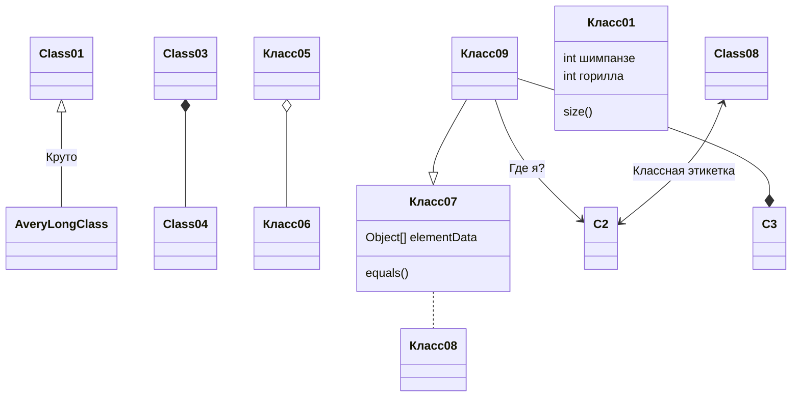

# Markdown Language

> **markdown** (mɑːkdaʊn — упрощение `кода`)
>
> **mermaid** (mɜːmeɪd — русалка)

 Язык разметки (**markup language**) — это система для аннотирования документа, которая делает его структуру и другие элементы видимыми для обработки программным обеспечением

Язык разметки представляет собой набор символов или кодов, встроенных в текст, который указывает структуру, оформление и тип содержимого документа.

Основная задача таких языков — создание определённого визуального представления текста путём логического структурирования, несмотря на его содержание.

Примеры языков разметки: HTML (основной язык разметки веб-страниц) и XML, предназначенный для обмена данными.

Языки разметки играют важную роль в областях веб-разработки, издательства, обмена данных и других технологических дисциплинах

**Markdown** — **облегчённый язык разметки, созданный для обозначения форматирования в простом тексте**. Он помогает делать текст читабельным как в исходном виде, так и в преобразованном формате, например в HTML.

**Некоторые преимущества Markdown:**

- **Простота и удобство**. Язык позволяет форматировать текст, не используя сложные текстовые процессоры.
- **Универсальность**. Документы в формате Markdown легко преобразуются в HTML, PDF или другие форматы.
- **Понятность исходного текста**. В отличие от кода HTML, текст Markdown остаётся читаемым.
- **Поддержка разных платформ**. Markdown можно использовать практически везде — от GitHub и Slack до современных редакторов (Visual Studio Code, Notion и другие).

HTML (**HyperText Markup Language**) - это стандартизированный язык гипертекстовой разметки документов для просмотра веб-страниц в браузере.

Основные характеристики:

Разработан Тимом Бернерсом-Ли в 1986-1991 годах в ЦЕРНе/ Изначально создавался как язык для обмена научной документацией. Является основой для создания веб-страниц. Работает на всех устройствах независимо от их технической оснащенности

Структура HTML-документа:

- Состоит из элементов, обозначаемых специальными тегами в угловых скобках
- Элементы могут быть пустыми (без содержимого)
- Могут содержать атрибуты для определения свойств
- Пример элемента: `<p>Это параграф</p>`
- Пример с атрибутом: `<a href="ссылка">Текст ссылки</a>`

Возможности HTML:

Создание заголовков и абзацев. Формирование списков и ссылок. Встраивание изображений. Создание веб-форм. Работа с таблицами. Поддержка мультимедийного контента

Современные версии: HTML5 (основная версия), HTML 5.1, HTML 5.2, HTML 5.3

HTML активно используется вместе с CSS (для стилизации) и JavaScript (для добавления интерактивности), образуя основу веба. Браузеры интерпретируют HTML-код и отображают его в виде понятной пользователю веб-страницы.

# Шпаргалка по Markdown 

Markdown — это простой в использовании язык разметки для написания текстов. Этот документ содержит все поддерживаемые функции Markdown.

## Содержание

- Синтаксис Markdown
  - [Заголовки](https://github.com/marktext/marktext/blob/master/docs/MARKDOWN_SYNTAX.md#headings)
  - [Абзацы](https://github.com/marktext/marktext/blob/master/docs/MARKDOWN_SYNTAX.md#paragraphs)
  - [Разрывы](https://github.com/marktext/marktext/blob/master/docs/MARKDOWN_SYNTAX.md#breaks)
  - [Горизонтальное правило](https://github.com/marktext/marktext/blob/master/docs/MARKDOWN_SYNTAX.md#horizontal-rule)
  - Акцент
    - [Смелый](https://github.com/marktext/marktext/blob/master/docs/MARKDOWN_SYNTAX.md#bold)
    - [Выделено курсивом](https://github.com/marktext/marktext/blob/master/docs/MARKDOWN_SYNTAX.md#italics)
    - [Зачеркнутый](https://github.com/marktext/marktext/blob/master/docs/MARKDOWN_SYNTAX.md#strikethrough)
  - Ссылки
    - [Автоматические ссылки](https://github.com/marktext/marktext/blob/master/docs/MARKDOWN_SYNTAX.md#autolinks)
    - [Встроенные ссылки](https://github.com/marktext/marktext/blob/master/docs/MARKDOWN_SYNTAX.md#inline-links)
    - [Заголовки ссылок](https://github.com/marktext/marktext/blob/master/docs/MARKDOWN_SYNTAX.md#link-titles)
    - [Именованные Якоря](https://github.com/marktext/marktext/blob/master/docs/MARKDOWN_SYNTAX.md#named-anchors)
  - [Изображения](https://github.com/marktext/marktext/blob/master/docs/MARKDOWN_SYNTAX.md#images)
  - [Цитаты из блоков](https://github.com/marktext/marktext/blob/master/docs/MARKDOWN_SYNTAX.md#blockquotes)
  - Списки
    - [Неупорядоченный](https://github.com/marktext/marktext/blob/master/docs/MARKDOWN_SYNTAX.md#unordered)
    - [Заказанный](https://github.com/marktext/marktext/blob/master/docs/MARKDOWN_SYNTAX.md#ordered)
    - [Совет по экономии времени](https://github.com/marktext/marktext/blob/master/docs/MARKDOWN_SYNTAX.md#time-saving-tip)
  - [Список дел](https://github.com/marktext/marktext/blob/master/docs/MARKDOWN_SYNTAX.md#todo-list)
  - Таблицы
    - [Выравнивание ячеек](https://github.com/marktext/marktext/blob/master/docs/MARKDOWN_SYNTAX.md#aligning-cells)
  - Код
    - [Встроенный код](https://github.com/marktext/marktext/blob/master/docs/MARKDOWN_SYNTAX.md#inline-code)
    - ["Огороженный" кодовый блок](https://github.com/marktext/marktext/blob/master/docs/MARKDOWN_SYNTAX.md#fenced-code-block)
    - [Код с отступом](https://github.com/marktext/marktext/blob/master/docs/MARKDOWN_SYNTAX.md#indented-code)
    - [Подсветка синтаксиса](https://github.com/marktext/marktext/blob/master/docs/MARKDOWN_SYNTAX.md#syntax-highlighting)
  - [Клавиши клавиатуры](https://github.com/marktext/marktext/blob/master/docs/MARKDOWN_SYNTAX.md#keyboard-keys)
  - [Эмодзи](https://github.com/marktext/marktext/blob/master/docs/MARKDOWN_SYNTAX.md#emojis)
  - [Передняя Материя](https://github.com/marktext/marktext/blob/master/docs/MARKDOWN_SYNTAX.md#front-matter)
  - Математические формулы
    - [Встроенные математические формулы](https://github.com/marktext/marktext/blob/master/docs/MARKDOWN_SYNTAX.md#inline-math-formulas)
    - [Блок Математических формул](https://github.com/marktext/marktext/blob/master/docs/MARKDOWN_SYNTAX.md#block-math-formulas)
  - [Диаграммы](https://github.com/marktext/marktext/blob/master/docs/MARKDOWN_SYNTAX.md#diagrams)
  - [Необработанный HTML](https://github.com/marktext/marktext/blob/master/docs/MARKDOWN_SYNTAX.md#raw-html)
  - [Экранирование с помощью обратной косой черты](https://github.com/marktext/marktext/blob/master/docs/MARKDOWN_SYNTAX.md#escaping-with-backslashes)
  - [Реквизиты](https://github.com/marktext/marktext/blob/master/docs/MARKDOWN_SYNTAX.md#credits)

## Заголовки

Заголовки от `h1` до `h6` строятся с помощью `#` для каждого уровня:

```
###### H6
##### H5
#### H4
### H3
## H2
# H1

В качестве альтернативы вы можете использовать заголовки ATX:

H1
======

H2
------
```


Рендерит для:

# Заголовок h1


## Заголовок h2


### Заголовок h3


#### Направление h4


##### Направление h5


###### Направление h6


В качестве альтернативы вы можете использовать подчеркивание:

# H1


## H2

## Абзацы

Просто напишите обычный текст:

```
Lorem ipsum dolor sit amet, греческий язык, да, или нет, или и то, и другое. И если бы вы читали, то знали бы, что животные молчаливы. И если бы вы были врагом, то не смогли бы ничего сделать. И если бы вы были рабом, то не смогли бы ничего сделать.
```

## Разрывы

Вы можете использовать несколько последовательных символов новой строки (`\n`) для создания дополнительных пробелов между разделами в документе в формате Markdown. Однако, если вам нужно убедиться, что дополнительные символы новой строки не будут объединены, вы можете использовать столько элементов HTML `<br>`, сколько захотите.

В качестве альтернативы вы можете добавить **два пробела** в конце абзаца, чтобы принудительно создать мягкий перенос строки.

## Горизонтальное правило

Элемент HTML `<hr>` используется для создания «тематического разрыва» между элементами уровня абзаца. В Markdown для этой цели можно использовать следующее:

- `___`: три последовательных подчеркивания
- `---`: три последовательных тире
- `***`: три звездочки подряд

Рендерит для:

------

------

------

## Акцент

### Смелый

Для выделения фрагмента текста более крупным шрифтом-weight.

Следующий фрагмент текста **выделен жирным шрифтом**.

```
**выделенный жирным шрифтом текст**
```

рендерит для:

**выделенный жирным шрифтом текст**

### Выделено курсивом

Для выделения фрагмента текста курсивом.

Следующий фрагмент текста *выделен курсивом*.

```
_текст, выделенный курсивом_
```

рендерит для:

*отображается в виде текста , выделенного курсивом*

## Зачеркнутый

В GFM можно делать подчёркивания, обрамляя текст двойными тильдами.

```
~~Пробегитесь по этому тексту.~~
```

Который визуализирует:

~~Перечеркните этот текст.~~

## Ссылки

### Автоматические ссылки

Автоссылки — это абсолютные URI и адреса электронной почты внутри `<` и `>`. Они анализируются как ссылки, где сам URI или адрес электронной почты используется в качестве метки ссылки.

```
<http://foo.bar.baz>
```

Рендерит для:

[http://foo.bar.baz](http://foo.bar.baz/)

URI-адреса или адреса электронной почты, не заключённые в угловые скобки, не распознаются парсерами Markdown как допустимые автоссылки.

### Встроенные ссылки

```
[Соберите](http://assemble.io)
```

Отображается в (наведите курсор на ссылку, всплывающей подсказки нет):

[Собрать](http://assemble.io/)

### Заголовки ссылок

```
[Upstage](https://github.com/upstage/ "Посетите Upstage!")
```

Отображает в (наведите курсор на ссылку, там должна появиться всплывающая подсказка):

[За сценой](https://github.com/upstage/)

### Именованные Якоря

Именованные привязки позволяют переходить к указанной точке привязки на той же странице. Например, каждая из этих глав:

```
[*
  #  ОглавлениеГлава 1](#глава-1)
  * [Глава 2](#глава-2)
  * [Глава 3](#глава-3)
```

перейдем к этим разделам:

```
## Глава 1
 Содержание первой главы.

## Глава 2
 Содержание первой главы.

## Глава 3 <a name="chapter-3"></a>
 Содержание первой главы.
```

**Размещение якоря**

Обратите внимание, что расположение ачоров произвольное, вы можете размещать их где угодно, а не только в заголовках. Это упрощает добавление перекрестных ссылок при написании кода.

## Изображения

Изображения имеют синтаксис, аналогичный ссылкам, но перед ними стоит восклицательный знак.

```

```

или

```

```

Как и ссылки, изображения также имеют синтаксис в стиле сноски

```
![Альтернативный текст][идентификатор]
```

Со ссылкой позже в документе, определяющей местоположение URL-адреса:

```
]id[: https://raw.githubusercontent.com/marktext/marktext/develop/resources/icons/256x256/marktext.png  "Логотип MarkText"
```

## Цитаты из блоков

Используется для определения раздела с текстом, взятым из другого источника, в вашем документе.

Чтобы создать блок-цитату, используйте `>` перед текстом, который вы хотите процитировать.

```
> Lorem ipsum dolor sit amet, consectetur adipiscing elit. Integer posuere erat a ante
```

Рендерит для:

> Lorem ipsum dolor sit amet, consectetur adipiscing elit. Integer posuere erat a ante.

Цитаты из блоков также могут быть вложенными:

```
> Duis massa lacus, ultricies a ullamcorper in, fermentum sed augue.
Nunc augue augue, aliquam non hendrerit ac, commodo vel nisi.
>> Sed adipiscing elit vitae augue consectetur a gravida nunc vehicula. Donec auctor
odio non est accumsan facilisis. Aliquam id turpis in dolor tincidunt mollis ac eu diam.
>>> Duis massa lacus, ultricies a ullamcorper in, fermentum sed augue.
Nunc augue augue, aliquam non hendrerit ac, commodo vel nisi.
```

Рендерит для:

> Массивный лаконский козел, с усами и бородой, но без шерсти. Nunc augue augue, aliquam non hendrerit ac, commodo vel nisi.
>
> > Sed adipiscing elit vitae augue consectetur a gravida nunc vehicula. Donec auctor odio non est accumsan facilisis. Aliquam id turpis in dolor tincidunt mollis ac eu diam.
> >
> > > Массивный лаконский козел, с усами и бородой, но без шерсти. Nunc augue augue, aliquam non hendrerit ac, commodo vel nisi.

## Списки

### Неупорядоченный

Список элементов, в котором порядок элементов не имеет особого значения.

Для обозначения каждого пункта списка вы можете использовать любой из следующих символов:

```
* допустимый символ
- допустимый символ
+ допустимый символ
```

Например

```
+ Lorem ipsum dolor sit amet
+ Consectetur adipiscing elit
+ Integer molestie lorem at massa
+ Facilisis in pretium nisl aliquet
+ Nulla volutpat aliquam velit
 - Phasellus iaculis neque
 - Purus sodales ultricies
 - Vestibulum laoreet porttitor sem
 - Ac tristique libero volutpat at
+ Фацибус порта лакуа, волнистая линия, или
+ Энаин, или эрат, или нун
+ Эгет, или портитор, или лорем
```

Рендерит для:

- Lorem ipsum dolor sit amet
- Consectetur adipiscing elit
- Integer molestie lorem at massa
- Facilisis in pretium nisl aliquet
- Nulla volutpat aliquam velit
  - Phasellus iaculis neque
  - Purus sodales ultricies
  - Vestibulum laoreet porttitor sem
  - Ac tristique libero volutpat at
- Faucibus porta lacus fringilla vel
- Aenean sit amet erat nunc
- Eget porttitor lorem

### Заказанный

Список элементов, в котором порядок элементов явно имеет значение.

```
.1 Lorem ipsum dolor sit amet
2. Consectetur adipiscing elit
3. Integer molestie lorem at massa
4. Facilisis in pretium nisl aliquet
5. Nulla volutpat aliquam velit
6. Faucibus porta lacus fringilla vel
7. Aenean sit amet erat nunc
8. Eget porttitor lorem
```

Рендерит для:

1. Lorem ipsum dolor sit amet
2. Consectetur adipiscing elit
3. Integer molestie lorem at massa
4. Facilisis in pretium nisl aliquet
5. Nulla volutpat aliquam velit
6. Faucibus porta lacus fringilla vel
7. Aenean sit amet erat nunc
8. Eget porttitor lorem

### Совет по экономии времени

Иногда списки меняются, и когда это происходит, приходится заново упорядочивать все числа. Markdown решает эту проблему, позволяя просто использовать `1.` перед каждым элементом списка.

Например:

```
.1 Lorem ipsum dolor sit amet
1. Consectetur adipiscing elit
1. Integer molestie lorem at massa
1. Facilisis in pretium nisl aliquet
1. Nulla volutpat aliquam velit
1. Faucibus porta lacus fringilla vel
1. Aenean sit amet erat nunc
1. Eget porttitor lorem
```

Автоматически перенумеровывает элементы и отображает их в:

1. Lorem ipsum dolor sit amet
2. Consectetur adipiscing elit
3. Integer molestie lorem at massa
4. Facilisis in pretium nisl aliquet
5. Nulla volutpat aliquam velit
6. Faucibus porta lacus fringilla vel
7. Aenean sit amet erat nunc
8. Eget porttitor lorem

## Список дел

```
[ ] - Lorem ipsum dolor sit amet
- [ ] Consectetur adipiscing elit
- [ ] Integer molestie lorem at massa
```

Рендерит для:

-  Lorem ipsum dolor sit amet
-  Consectetur adipiscing elit
-  Integer molestie lorem at massa

**Ссылки в списках задач**

```
[ [ ] -foo](#bar)
- [ ] [baz](#qux)
- [ ] [fez](#faz)
```

Рендерит для:

-  [фу](https://github.com/marktext/marktext/blob/master/docs/MARKDOWN_SYNTAX.md#bar)
-  [баз](https://github.com/marktext/marktext/blob/master/docs/MARKDOWN_SYNTAX.md#qux)
-  [fez](https://github.com/marktext/marktext/blob/master/docs/MARKDOWN_SYNTAX.md#faz)

## Таблицы

Таблицы создаются путём добавления разделителей в виде вертикальных линий между ячейками и добавления строки из тире (также разделённых вертикальными линиями) под заголовком *(эта строка из тире обязательна)*.

- трубы не обязательно должны быть выровнены по вертикали.
- трубы на левой и правой сторонах стола иногда являются необязательными
- для каждой ячейки в строке разделителя необходимо использовать три или более тире

Пример:

```
| Параметр | Описание |
| ------ | ----------- |
| data | путь к файлам данных для предоставления данных, которые будут передаваться в шаблоны. |
| engine | движок, используемый для обработки шаблонов. По умолчанию используется Handlebars. |
| ext | расширение, используемое для целевых файлов. |
```

Рендерит для:

| Вариант    | Описание                                                     |
| ---------- | ------------------------------------------------------------ |
| данные     | путь к файлам данных для предоставления данных, которые будут переданы в шаблоны. |
| двигатель  | движок, который будет использоваться для обработки шаблонов. По умолчанию используется Handlebars. |
| внутренний | расширение, которое будет использоваться для файлов dest.    |

### Выравнивание ячеек

**Расположите текст по центру столбца**

Чтобы выровнять текст по центру в столбце, добавьте двоеточие слева и справа от тире в строке под заголовком.

```
| Опция | Описание |
| :-: | :-: |
| data | путь к файлам данных для предоставления данных, которые будут передаваться в шаблоны. |
| engine | движок, используемый для обработки шаблонов. По умолчанию используется Handlebars. |
| ext | расширение, используемое для целевых файлов. |
```


| Вариант    | Описание                                                     |
| ---------- | ------------------------------------------------------------ |
| данные     | путь к файлам данных для предоставления данных, которые будут переданы в шаблоны. |
| двигатель  | движок, который будет использоваться для обработки шаблонов. По умолчанию используется Handlebars. |
| внутренний | расширение, которое будет использоваться для файлов dest.    |

**Выровняйте текст в столбце по правому краю**

Чтобы выровнять текст по правому краю в столбце, добавьте двоеточие справа от тире в строке под заголовком.

```
| Параметр | Описание |
| ------:| -----------:|
| data | путь к файлам данных для предоставления данных, которые будут передаваться в шаблоны. |
| engine | механизм, используемый для обработки шаблонов. По умолчанию используется Handlebars. |
| ext | расширение, используемое для целевых файлов. |
```

Рендерит для:

| Вариант    | Описание                                                     |
| ---------- | ------------------------------------------------------------ |
| данные     | путь к файлам данных для предоставления данных, которые будут переданы в шаблоны. |
| двигатель  | движок, который будет использоваться для обработки шаблонов. По умолчанию используется Handlebars. |
| внутренний | расширение, которое будет использоваться для файлов dest.    |

## Код

### Встроенный код

Оберните встроенные фрагменты кода одним обратным знаком: ```.

Например, чтобы отобразить `<div></div>` в строке с другим текстом, просто заключите его в обратные кавычки.

```
Например, чтобы отобразить `<div></div>` вместе с другим текстом, просто заключите его в обратные кавычки.
```

### "Огороженный" кодовый блок

Три последовательные обратные кавычки, называемые «кодовыми блоками», используются для обозначения нескольких строк кода: `````.

Например, это:

````
``html
Пример текста здесь...
```
````

При просмотре в браузере выглядит следующим образом:

```
Пример текста здесь...
```

### Код с отступом

Вы также можете отступить от нескольких строк кода как минимум на четыре пробела, но это не рекомендуется, так как такой код сложнее читать, поддерживать и он не поддерживает подсветку синтаксиса.

Пример:

```
    // Некоторые комментарии
    строка 1 кода
    строка 2 кода
    строка 3 кода
```


```
// Some comments
line 1 of code
line 2 of code
line 3 of code
```

### Подсветка синтаксиса

Чтобы активировать правильную стилистику для языка внутри блока кода, просто добавьте расширение файла языка, который вы хотите использовать, сразу после первого «забора» кода: ````js`, и подсветка синтаксиса автоматически применится в отображаемом HTML (если поддерживается синтаксическим анализатором). Например, чтобы применить подсветку синтаксиса к коду JavaScript:

````
```

grunt.initConfig({
сборка: {,
параметры: {,
ресурсы: 'docs/assets',
данные: 'src/data/*.{json,yml}',
помощники: 'src/custom-helpers.js',
частичные: ['src/partials/**/*.{hbs,md}']
 },
страницы: {,
параметры: {,
макет: 'default.hbs'
 },
 файлы: {
 './': ['src/templates/pages/index.hbs']
 }
 }
 }
});
```
````

Который визуализирует:

```
assembly{(initConfig.
  grunt: {
    опции: {
      активы: 'docs/assets',
      данные: 'src/data/*.{json, yml}',
      помощники: 'src/custom-helpers.js ',
      части: ['src/partials/**/*.{hbs,md}']
    },
    страницы: {
      параметры: {
        макет: 'default.hbs'
      },
      файлы: {
        './': [src/templates/pages/index.hbs']
      }
    
  
}) ;
```


## Клавиши клавиатуры

Markdown в стиле Github (GFM) позволяет выделять клавиши клавиатуры.

Например, это:

```
Чтобы скопировать, нажмите <kbd>CmdOrCtrl</kbd>+<kbd>C</kbd>

Чтобы вставить, нажмите <kbd>CmdOrCtrl</kbd>+<kbd>V</kbd>
```

Который визуализирует:

Чтобы скопировать, пожалуйста, нажмите CmdOrCtrl+C

Чтобы вставить, пожалуйста, нажмите CmdOrCtrl+V

## Эмодзи

Markdown в стиле Github (GFM) поддерживает также эмодзи. 😍 😄 😂

Чтобы добавить эмодзи, просто заключите название эмодзи в двоеточия, как показано ниже:

```
:сердце: :щелчок: :корова: :доллар: :звезда: :тада:
```

Который визуализирует:

❤️ ⚡ 🐮 💵 ⭐ 🎉

**ПРИМЕЧАНИЕ:** MarkText предоставляет средство выбора эмодзи с функцией поиска.

## Передняя Материя

Блок «Сведения о книге» позволяет добавлять метаданные в документ в формате Markdown. Блок «Сведения о книге» должен быть написан в первой строке перед всем остальным, как в примерах ниже.

### YAML

Блоки передней панели YAML обозначаются открывающей и закрывающей `---` линиями.

```
title
---: Пример YAML-преамбулы
ключ: значение
---

Lorem ipsum dolor sit amet, graecis denique ei vel, at duo primis mandamus.
```

### ТОМЛ

Блоки TOML front matter обозначаются линией открытия и закрытия `+++`.

```
title
+++ = "Пример YAML-предисловия"
key = "значение"
+++

 Lorem ipsum dolor sit amet, graecis denique ei vel, at duo primis mandamus.
```

### JSON

Блоки метаданных JSON обозначаются открывающей и закрывающей строками `;;;` или `{` и `}`.

```
{
"title": пример YAML-предисловия
"key": {
 "subkey1": "значение 1",
 "subkey2": "значение 2"
}
}

Lorem ipsum dolor sit amet, graecis denique ei vel, at duo primis mandamus.
```

## Математические формулы


### Встроенные математические формулы

Оберните одну линию LaTeX одним знаком доллара: `$`.

```
Например, чтобы отобразить $\alpha \beta \gamma$ в строке с другим текстом, просто заключите его в знаки доллара.
```


### Блок Математических формул

Два знака доллара подряд используются для обозначения нескольких строк математических формул: `$$`.

Например, это:

```
$$
\end{pmatrix}
0 & 0 & 0 & 1
0 & sin(a) & cos(a) & 0\\
0 & cos(a) & -sin(a) & 0\\
1 & 0 & 0 & 0\\
R_x=\begin{pmatrix}
$$

или

$$
m=\frac{b_y-a_y}{b_x-a_x}
$$
```


## Диаграммы

Класс поддержки MarkText, блок-схемы, диаграммы Ганта и последовательности на основе flowchart.js, mermaid и Vega-Lite. [Блоки кода](https://github.com/marktext/marktext/blob/master/docs/MARKDOWN_SYNTAX.md#code) со специальными языковыми идентификаторами используются для диаграмм.

Например, это:

````
## Диаграмма Vega-lite

Пожалуйста, ознакомьтесь с [введением в Vega-Lite](https://vega.github.io/vega-lite/tutorials/getting_started.html) для получения подробной информации.

```vega-lite
{
 "данные": {
 "ценности": [
 {"a": "C", "b": 2}, {"a": "C", "b": 7}, {"a": "C", "b": 4}, 
 {"a": "D", "b": 1}, {"a": "D", "b": 2}, {"a": "D", "b": 6}, 
 {"a": "E", "b": 8}, {"a": "E", "b": 4}, {"a": "E", "b": 7}
 ]
 },
 "метка": "точка",
 "кодировка": {
 "x": {"поле": "a", "тип": "номинальный"},
 "y": {"поле": "b", "тип": "количественный"}
 }
}
```

## Блок-схема

```блок-схема
st=>начало: Начало|прошлое
e=>конец: Конец|будущее
op1=>операция: Моя операция|прошлое
op2=>операция: Вещи|текущее
sub1=>подпрограмма: Моя подпрограмма|неверная
cond=>условие: Да
или Нет?|одобрено:>http://www.google.com
c2=>условие: хорошая идея|отклонено
io=>ввод-вывод: поймать что-то...|будущее

st->op1(справа)->cond
cond(да, справа)->c2
cond(нет)->sub1(слева)->op1
c2(да)->io->e
c2(нет)->op2->e
```

## Диаграмма последовательности

```sequence
Заголовок: Вот заголовок
A->B: Обычная линия
B-->C: Пунктирная линия
C->>D: Открытая стрелка
D-->>A: Пунктирная открытая стрелка
```

## Блок-схема

```mermaid
график TD;
 A-->B;
 A-->C;
 B-->D;
 C-->D;
```

## Диаграмма последовательности

```mermaid
последовательность диаграмм
 участник Алиса
 участник Боб
 Алиса->>Джон: Привет, Джон, как дела?
 цикл Проверка здоровья
 Джон->>Джон: Борьба с ипохондрией
 конец
 Примечание справа от Джона: Какая-то заметка
 Джон-->>Алиса: Отлично!
 Джон->>Боб: А ты как?
 Боб-->>Джон: Замечательно!
```

## Диаграмма Ганта

```mermaid
gantt
формат даты YYYY-MM-DD
название Добавление диаграммы Ганта в mermaid
исключает будние дни 2014-01-10

раздел A
Выполненная задача :выполнена, des1, 2014-01-06,2014-01-08
Активная задача: active, des2, 2014-01-09, 3d
Будущая задача: des3, после des2, 5d
Будущая задача2: des4, после des3, 5d
```

## Диаграмма классов (экспериментальная)


````

## Растение

Пожалуйста, посетите [веб-сайт PlantUML](https://plantuml.com/) для получения более подробной информации.

```
Боб
-> Алиса @startuml: запрос на аутентификацию
Боб --> Алиса: ответ на запрос на аутентификацию

Алиса -> Боб: ещё один запрос на аутентификацию
Алиса <-- Боб: ещё один ответ на запрос на аутентификацию
@enduml
```


## Необработанный HTML

Любой текст между `<` и `>`, похожий на HTML-тег, будет распознан как необработанный HTML-тег и преобразован в HTML без экранирования.

Пример:

```
**Посетите <a href="https://github.com"> Профиль Джона Шлинкерта на GitHub</a>.**
```

Рендерит для:

**Посетите [профиль Джона Шлинкерта на GitHub](https://github.com/).**

## Экранирование с помощью обратной косой черты

Любой символ пунктуации ASCII может быть экранирован с помощью одной обратной косой черты.

Пример:

```
\*это не выделено курсивом*
```

Рендерит для:

\* это не выделено курсивом*

## Реквизиты

Эта шпаргалка по Markdown 

## Обзор

**Markdown** создан компанией [Daring Fireball](http://daringfireball.net/); оригинальное руководство находится [здесь](http://daringfireball.net/projects/markdown/syntax). Однако его синтаксис варьируется в зависимости от разных парсеров или редакторов. Рекомендую использовать **Typora** который использует [Markdown в стиле GitHub](https://help.github.com/articles/github-flavored-markdown/).

Markdown - проект по упрощение HTML разметки
Обзор
Блочные элементы
Разрывы абзацев и строк
Заголовки
Цитаты из блоков
Списки
Список задач
(Огороженные) Кодовые блоки
Математические блоки
Таблицы
Примечания
Горизонтальные Правила
Вопрос Фронта YAML
Оглавление (TOC)
Пролетные элементы
Ссылки
Внутренние ссылки
Справочные ссылки
URL -адреса
Изображения
Акцент
Сильный
Код
Зачеркнутый
Подчеркивает
Смайлики 😄
Встроенная Математика
Нижний индекс
Надстрочный индекс
Выделите
HTML
Встраивать содержимое
Видео
Другая Поддержка HTML

## Блочные элементы

### Разрывы абзацев и строк

Абзац — это просто одна или несколько последовательных строк текста. В исходном коде Markdown абзацы разделяются двумя или более пустыми строками. В Typora для создания нового абзаца достаточно одной пустой строки (нажмите `Return` один раз).

Нажмите `Shift` + `Return`, чтобы создать разрыв строки. Большинство других парсеров Markdown игнорируют разрывы строк, поэтому, чтобы другие парсеры Markdown распознавали ваш разрыв строки, вы можете оставить два пробела в конце строки или вставить `<br/>`.

### Заголовки

В заголовках используются 1-6 символов хеша (`#`) в начале строки, что соответствует уровням заголовков 1-6. Например:

```
# Это H1

## Это H2

###### Это H6
```

В Typora введите «#», затем содержимое заголовка и нажмите `Return`, чтобы создать заголовок.

### Цитаты из блоков

В Markdown для блочных кавычек используются символы > в стиле электронной почты. Они выглядят так:

```
> Это блок-цитата с двумя абзацами.  Это первый абзац.
>
> Это второй абзац. Vestibulum enim wisi, viverra nec, fringilla in, laoreet vitae, risus.


> Это ещё одна блок-цитата с одним абзацем.  Для разделения двух блок-цитат есть три пустые строки.
```

В Typora при вводе «>» и последующем вводе содержимого цитаты будет создан блок цитат. Typora вставит за вас нужный «>» или перенос строки. Вложенные блоки цитат (блок цитат внутри другого блока цитат) можно создать, добавив дополнительные уровни «>».

### Списки

Ввод `* list item 1` создаст неупорядоченный список — символ `*` можно заменить на `+` или `-`.

Ввод `1. list item 1` создаст упорядоченный список — их исходный код в формате Markdown выглядит следующим образом:

```
## неупорядоченный список
* Красный
* Зеленый
* Синий

## упорядоченный список
1. Красный
2.  Зеленый
3.  Синий
```

### Список задач

Списки задач — это списки с элементами, отмеченными как [ ] или [x] (неполные или полные). Например:

```
- [ ] элемент списка задач
- [ ] требуется синтаксис списка
- [ ] нормальный **формат**, @упоминания, #1234 ссылки
- [ ] неполный
- [x] Завершено
```

Вы можете изменить состояние «выполнено»/«не выполнено», нажав на флажок перед пунктом.

### (Огороженные) Кодовые блоки

Typora поддерживает только блоки кода в стиле GitHub Flavored Markdown. Оригинальные блоки кода в стиле Markdown не поддерживаются.

Использовать разделители очень просто: введите ``` и нажмите `return`. Добавьте необязательный идентификатор языка после ```, и мы выделим синтаксис:

````
Вот пример:

``js
функция тест() {
  console.log("обратите внимание на пустую строку перед этой функцией?");
}
```

подсветка синтаксиса:
``руби
требуется "красный карп"
markdown = Redcarpet.new("Привет, мир!")
ставит уценку.to_html
```
````

### Математические блоки

Вы можете визуализировать *Латекс*математические выражения с использованием **MathJax**.

Чтобы добавить математическое выражение, введите `$$` и нажмите клавишу "Return". Это вызовет поле ввода, которое принимает *Текстиль/латекс*Источник. Например:

𝑉1×𝑉2=|𝑖𝑗𝑘𝜕𝑋𝜕𝑢𝜕𝑌𝜕𝑢0𝜕𝑋𝜕𝑣𝜕𝑌𝜕𝑣0|

В исходном файле уценки математический блок представляет собой *выражение на языке LaTeX*, заключенное в пару знаков ‘$$’:

```
$$
\mathbf{V}_1 \times \mathbf{V}_2 = \begin{vmatrix}
\mathbf{i} & \mathbf{j} & \mathbf{k} \\
\frac{\partial X}{\partial u} & \frac{\partial Y}{\partial u} & 0 \\
\frac{\partial X}{\partial v} & \frac{\partial Y}{\partial v} & 0 \\
\end{виртуальная матрица}
$$
```

Вы можете найти более подробную информацию [здесь](https://support.typora.io/Math/).

### Таблицы

Введите `| First Header  | Second Header |` и нажмите `return` клавишу. Это создаст таблицу с двумя столбцами.

После создания таблицы при наведении курсора на эту таблицу откроется панель инструментов для таблицы, где вы можете изменить размер, выровнять или удалить таблицу.  Вы также можете использовать контекстное меню для копирования и добавления/удаления отдельных столбцов/строк.

Полный синтаксис таблиц описан ниже, но необязательно знать его в деталях, так как исходный код уценки для таблиц генерируется автоматически с помощью Typora.

В исходном коде markdown они выглядят следующим образом:

```
| Первый заголовок | Второй Заголовок |
| ------------- | ------------- |
| Ячейка содержимого | Ячейка содержимого |
| Ячейка содержимого | Ячейка содержимого |
```

Вы также можете добавить в таблицу встроенные элементы Markdown, такие как ссылки, выделение жирным шрифтом, курсивом или подчёркиванием.

Наконец, добавив двоеточия (`:`) в строку заголовка, вы можете выровнять текст в этом столбце по левому краю, по правому краю или по центру:

```
| Выровнено по левому краю | По центру | По правому краю |
| :------------ |:---------------:| -----:|
| столбец 3 — это | многословный текст | 1600 долларов |
| col 2 равен | по центру | $ 12 |
| полосы зебры | аккуратные | 1 доллар |
```

Двоеточие с левой стороны указывает на выравнивание по левому краю; двоеточие с правой стороны указывает на выравнивание по правому краю; двоеточие с обеих сторон указывает на выравнивание по центру.

### Примечания

```
Вы можете создавать сноски, подобные этой[^сноска].

[^сноска]: Вот *текст* **сноски**.
```

произведет:

Вы можете создавать сноски следующим образом[1](#dfref-footnote-1).

Наведите курсор на верхний индекс «сноски», чтобы увидеть содержимое сноски.

### Горизонтальные Правила

При вводе `***` или `---` на пустой строке и нажатии `return` будет нарисована горизонтальная линия.

------

### Вопрос Фронта YAML

Typora теперь поддерживает [YAML-метаданные](http://jekyllrb.com/docs/frontmatter/). Введите `---` в верхней части статьи, а затем нажмите `Return` для добавления блока метаданных. Кроме того, вы можете вставить блок метаданных из верхнего меню Typora.

### Оглавление (TOC)

Введите `[toc]` и нажмите клавишу `Return` . Это создаст раздел «Оглавление». Оглавление извлекает все заголовки из документа, и его содержимое автоматически обновляется по мере добавления в документ.

## Пролетные элементы

Элементы span будут проанализированы и отображены сразу после ввода. Если вы переместите курсор в середину этих элементов span, они будут преобразованы в исходный код уценки. Ниже приведено описание синтаксиса для каждого элемента span.

### Ссылки

Markdown поддерживает два стиля ссылок: встроенные и ссылочные.

В обоих стилях текст ссылки заключается в [квадратные скобки].

Чтобы создать встроенную ссылку, используйте обычные скобки сразу после закрывающей квадратной скобки в тексте ссылки. Внутри скобок укажите URL-адрес, на который должна вести ссылка, а также необязательное название ссылки, заключённое в кавычки. Например:

```
Это [пример](http://example.com/ «Название») встроенная ссылка.

(http://example.net/)[Эта ссылка] не имеет атрибута title.
```

произведет:

Это [пример](http://example.com/) встроенная ссылка. (`<p>This is <a href="http://example.com/" title="Title">`)

[Эта ссылка](http://example.net/) не имеет атрибута title. (`<p><a href="http://example.net/">This link</a> has no`)

#### Внутренние ссылки

**Вы можете установить ссылку на заголовки,** что создаст закладку, которая позволит вам перейти к этому разделу после нажатия. Например:

Команда (в Windows: Ctrl) + щелчок по [этой ссылке](#block-elements) приведет к переходу к заголовку `Block Elements`. Чтобы увидеть, как это написать, пожалуйста, переместите курсор или щелкните по этой ссылке, удерживая нажатой клавишу `⌘`, чтобы развернуть элемент в исходный код уценки.

#### Справочные ссылки

Ссылки в стиле ссылок-ссылок используют второй набор квадратных скобок, внутри которых вы размещаете метку по своему усмотрению, чтобы идентифицировать ссылку:

```
Это ссылка в стиле [пример][идентификатор].

Затем в любом месте документа вы определяете метку ссылки в отдельной строке следующим образом:

[id]: http://example.com/ «Дополнительный заголовок здесь»
```

В Typora они будут отображаться следующим образом:

Это [пример](http://example.com/) ссылка в ссылочном стиле.

Неявное имя ссылки позволяет опустить название ссылки, в этом случае в качестве названия используется сам текст ссылки. Просто используйте пустой набор квадратных скобок — например, чтобы связать слово «Google» с сайтом google.com, можно просто написать:

```
[Google][]
А затем определите ссылку:

[Google]: http://google.com/
```

В Typora при нажатии на ссылку она откроется для редактирования, а сочетание клавиш Command+Click откроет гиперссылку в вашем веб-браузере.

### URL -адреса

Typora позволяет вставлять URL-адреса в виде ссылок, заключённых в `<`скобки`>`.

`<i@typora.io>` становится [i@typora.io](mailto:i@typora.io).

Typora также автоматически создаст ссылки на стандартные URL-адреса. Например: [www.google.com](http://www.google.com).

### Изображения

Изображения имеют тот же синтаксис, что и ссылки, но перед началом ссылки требуется дополнительный `!` символ. Синтаксис для вставки изображения выглядит следующим образом:

```


```

Вы можете использовать перетаскивание для вставки изображения из файла или из веб-браузера. Вы можете изменить исходный код уценки, нажав на изображение. Относительный путь будет использоваться, если изображение, добавленное с помощью перетаскивания, находится в том же каталоге или подкаталоге, что и документ, который вы редактируете в данный момент.

Если вы используете Markdown для создания веб-сайтов, вы можете указать префикс URL для предварительного просмотра изображения на локальном компьютере с помощью свойства `typora-root-url` в YAML Front Matters. Например, введите `typora-root-url:/User/Abner/Website/typora.io/` в YAML Front Matters, а затем `` будет обрабатываться как `` в Typora.

Вы можете найти более подробную информацию [здесь](https://support.typora.io/Images/).

### Акцент

В Markdown звездочки (`*`) и подчеркивания (`_`) используются для выделения текста. Текст, заключенный в один `*` или `_` тег, будет заключен в HTML-тег `<em>`. Например:

```
* одиночные звездочки*

_single подчеркивания_
```

выходной сигнал:

*одиночные звездочки*

*одиночные подчеркивания*

GFM будет игнорировать подчёркивания в словах, которые обычно используются в коде и названиях, например:

> wow_great_stuff
>
> сделай_это_и_сделай_то_и_ещё_кое-что.

Чтобы поставить буквальную звёздочку или подчёркивание в том месте, где они в противном случае использовались бы в качестве разделителей акцента, можно экранировать их обратной косой чертой:

```
\* этот текст окружен буквенными звездочками\*
```

Typora рекомендует использовать символ `*`.

### Сильный

Двойной `*` или `_` приведет к тому, что содержимое, заключенное в него, будет обернуто HTML-тегом `<strong>`, например:

```
** двойные звездочки**

__ двойное подчеркивание__
```

выходной сигнал:

**двойные звездочки**

**двойное подчеркивание**

Typora рекомендует использовать `**` символ.

### Код

Чтобы выделить фрагмент кода, заключите его в обратные кавычки (`). В отличие от предварительно отформатированного блока кода, фрагмент кода выделяется в обычном абзаце. Например:

```
Используйте функцию `printf()`.
```

произведет:

Используйте функцию `printf()`.

### Зачеркнутый

GFM добавляет синтаксис для создания текста с подчёркиванием, которого нет в стандартном Markdown.

`~~Mistaken text.~~` становится ~~Текст с ошибкой.~~

### Подчеркивает

Подчеркивание основано на необработанном HTML.

`<u>Underline</u>` становится Подчеркивать.

### Эмодзи😄

Введите эмодзи с синтаксисом `:smile:`.

Пользователь может активировать автозаполнение для эмодзи, нажав `ESC` клавишу, или активировать его автоматически после включения в панели настроек.  Кроме того, можно напрямую вводить символы эмодзи UTF-8, перейдя в раздел `Edit` -> `Emoji & Symbols` в строке меню (macOS).

### Встроенная Математика

Чтобы использовать эту функцию, сначала включите ее на `Preference` панели -> `Markdown` вкладке. Затем используйте `$` для обертывания команды TeX. Например: `$\lim_{x \to \infty} \exp(-x) = 0$` будет отображаться как команда LaTeX.

Чтобы включить встроенный предварительный просмотр для встроенных математических формул: введите «$», затем нажмите клавишу `ESC`, затем введите команду TeX.

Вы можете найти более подробную информацию [здесь](https://support.typora.io/Math/).

### Нижний индекс

Чтобы использовать эту функцию, сначала включите ее на `Preference` панели -> `Markdown` вкладке. Затем используйте `~` для переноса содержимого нижнего индекса. Например: `H~2~O`, `X~long\ text~`/

### Надстрочный индекс

Чтобы использовать эту функцию, сначала включите ее на `Preference` панели -> `Markdown` вкладке. Затем используйте `^` для переноса содержимого надстрочного индекса. Например: `X^2^`.

### Выделите

Чтобы использовать эту функцию, сначала включите ее на `Preference` панели -> `Markdown` вкладке. Затем используйте `==` для выделения содержимого. Например: `==highlight==`.

## HTML

Вы можете использовать HTML для оформления контента, который не поддерживается в чистом Markdown. Например, используйте `<span style="color:red">this text is red</span>` для добавления текста красного цвета.

### Встраивать содержимое

Некоторые веб-сайты предоставляют встраиваемый код на основе iframe, который вы также можете вставить в Typora. Например:

```
heightiframe <='265' прокрутка='нет' title='Необычное анимированное SVG-меню' src= 'http://codepen.io/jeangontijo/embed/OxVywj/?height=265&theme-id=0&default-tab=css,result&embed-version=2'  frameborder='no' allowtransparency='true' allowfullscreen='true' style='width: 100%;'></iframe>
```

### Видео

Вы можете использовать `<video>` HTML-тег для встраивания видео. Например:

```
srcвидео <="xxx.mp4" />
```

### Другая Поддержка HTML

Вы можете найти более подробную информацию [здесь](https://support.typora.io/HTML/).

------

1 Вот *текст* **сноски**. [↩](#ref-footnote-1)


**markdown** (mɑːkdaʊn - упрощение `кода HTML`)

**mermaid**(mɜːmeɪd - русалка)


## Overview

**Markdown** is created by [Daring Fireball](http://daringfireball.net/); the original guideline is [here](http://daringfireball.net/projects/markdown/syntax). Its syntax, however, varies between different parsers or editors. **Typora** is using [GitHub Flavored Markdown][GFM].

[toc]

## Block Elements

### Paragraph and line breaks

A paragraph is simply one or more consecutive lines of text. In markdown source code, paragraphs are separated by two or more blank lines. In Typora, you only need one blank line (press `Return` once) to create a new paragraph.

Press `Shift` + `Return` to create a single line break. Most other markdown parsers will ignore single line breaks, so in order to make other markdown parsers recognize your line break, you can leave two spaces at the end of the line, or insert `<br/>`.

### Headers

Headers use 1-6 hash (`#`) characters at the start of the line, corresponding to header levels 1-6. For example:

``` markdown
# This is an H1

## This is an H2

###### This is an H6
```

In Typora, input ‘#’s followed by title content, and press `Return` key will create a header.

### Blockquotes

Markdown uses email-style > characters for block quoting. They are presented as:

``` markdown
> This is a blockquote with two paragraphs. This is first paragraph.
>
> This is second pragraph. Vestibulum enim wisi, viverra nec, fringilla in, laoreet vitae, risus.


> This is another blockquote with one paragraph. There is three empty line to seperate two blockquote.
```

In Typora, inputting ‘>’ followed by your quote contents will generate a quote block. Typora will insert a proper ‘>’ or line break for you. Nested block quotes (a block quote inside another block quote) by adding additional levels of ‘>’.

### Lists

Input `* list item 1` will create an unordered list - the `*` symbol can be replace with `+` or `-`.

Input `1. list item 1` will create an ordered list - their markdown source code is as follows:

``` markdown
## un-ordered list
*   Red
*   Green
*   Blue

## ordered list
1.  Red
2. 	Green
3.	Blue
```

### Task List

Task lists are lists with items marked as either [ ] or [x] (incomplete or complete). For example:

``` markdown
- [ ] a task list item
- [ ] list syntax required
- [ ] normal **formatting**, @mentions, #1234 refs
- [ ] incomplete
- [x] completed
```

You can change the complete/incomplete state by clicking on the checkbox before the item.

### (Fenced) Code Blocks

Typora only supports fences in GitHub Flavored Markdown. Original code blocks in markdown are not supported.

Using fences is easy: Input \`\`\` and press `return`. Add an optional language identifier after \`\`\` and we'll run it through syntax highlighting:

````gfm
Here's an example:

```js
function test() {
  console.log("notice the blank line before this function?");
}
```

syntax highlighting:
```ruby
require 'redcarpet'
markdown = Redcarpet.new("Hello World!")
puts markdown.to_html
```
````

### Math Blocks

You can render *LaTeX* mathematical expressions using **MathJax**.

To add a mathematical expression, input `$$` and press the 'Return' key. This will trigger an input field which accepts *Tex/LaTex* source. For example:


$$
\mathbf{V}_1 \times \mathbf{V}_2 =  \begin{vmatrix}
\mathbf{i} & \mathbf{j} & \mathbf{k} \\
\frac{\partial X}{\partial u} &  \frac{\partial Y}{\partial u} & 0 \\
\frac{\partial X}{\partial v} &  \frac{\partial Y}{\partial v} & 0 \\
\end{vmatrix}
$$


In the markdown source file, the math block is a *LaTeX* expression wrapped by a pair of ‘$$’ marks:

``` markdown
$$
\mathbf{V}_1 \times \mathbf{V}_2 =  \begin{vmatrix}
\mathbf{i} & \mathbf{j} & \mathbf{k} \\
\frac{\partial X}{\partial u} &  \frac{\partial Y}{\partial u} & 0 \\
\frac{\partial X}{\partial v} &  \frac{\partial Y}{\partial v} & 0 \\
\end{vmatrix}
$$
```

You can find more details [here](https://support.typora.io/Math/).

### Tables

Input `| First Header  | Second Header |` and press the `return` key. This will create a table with two columns.

After a table is created, putting focus on that table will open up a toolbar for the table where you can resize, align, or delete the table. You can also use the context menu to copy and add/delete individual columns/rows.

The full syntax for tables is described below, but it is not necessary to know the full syntax in detail as the markdown source code for tables is generated automatically by Typora.

In markdown source code, they look like:

``` markdown
| First Header  | Second Header |
| ------------- | ------------- |
| Content Cell  | Content Cell  |
| Content Cell  | Content Cell  |
```

You can also include inline Markdown such as links, bold, italics, or strikethrough in the table.

Finally, by including colons (`:`) within the header row, you can define text in that column to be left-aligned, right-aligned, or center-aligned:

``` markdown
| Left-Aligned  | Center Aligned  | Right Aligned |
| :------------ |:---------------:| -----:|
| col 3 is      | some wordy text | $1600 |
| col 2 is      | centered        |   $12 |
| zebra stripes | are neat        |    $1 |
```

A colon on the left-most side indicates a left-aligned column; a colon on the right-most side indicates a right-aligned column; a colon on both sides indicates a center-aligned column.

### Footnotes

``` markdown
You can create footnotes like this[^footnote].

[^footnote]: Here is the *text* of the **footnote**.
```

will produce:

You can create footnotes like this[^footnote].

[^footnote]: Here is the *text* of the **footnote**.

Hover over the ‘footnote’ superscript to see content of the footnote.

### Horizontal Rules

Inputting `***` or `---` on a blank line and pressing `return` will draw a horizontal line.

------

### YAML Front Matter

Typora now supports [YAML Front Matter](http://jekyllrb.com/docs/frontmatter/). Input `---` at the top of the article and then press `Return` to introduce a metadata block. Alternatively, you can insert a metadata block from the top menu of Typora.

### Table of Contents (TOC)

Input `[toc]` and press the `Return` key. This will create a  “Table of Contents” section. The TOC extracts all headers from the document, and its contents are updated automatically as you add to the document.

## Span Elements

Span elements will be parsed and rendered right after typing. Moving the cursor in middle of those span elements will expand those elements into markdown source. Below is an explanation of the syntax for each span element.

### Links

Markdown supports two styles of links: inline and reference.

In both styles, the link text is delimited by [square brackets].

To create an inline link, use a set of regular parentheses immediately after the link text’s closing square bracket. Inside the parentheses, put the URL where you want the link to point, along with an optional title for the link, surrounded in quotes. For example:

``` markdown
This is [an example](http://example.com/ "Title") inline link.

[This link](http://example.net/) has no title attribute.
```

will produce:

This is [an example](http://example.com/ "Title") inline link. (`<p>This is <a href="http://example.com/" title="Title">`)

[This link](http://example.net/) has no title attribute. (`<p><a href="http://example.net/">This link</a> has no`)

#### Internal Links

**You can set the href to headers**, which will create a bookmark that allow you to jump to that section after clicking. For example:

Command(on Windows: Ctrl) + Click [This link](#block-elements) will jump to header `Block Elements`. To see how to write that, please move cursor or click that link with `⌘` key pressed to expand the element into markdown source.

#### Reference Links

Reference-style links use a second set of square brackets, inside which you place a label of your choosing to identify the link:

``` markdown
This is [an example][id] reference-style link.

Then, anywhere in the document, you define your link label on a line by itself like this:

[id]: http://example.com/  "Optional Title Here"
```

In Typora, they will be rendered like so:

This is [an example][id] reference-style link.

[id]: http://example.com/	"Optional Title Here"

The implicit link name shortcut allows you to omit the name of the link, in which case the link text itself is used as the name. Just use an empty set of square brackets — for example, to link the word “Google” to the google.com web site, you could simply write:

``` markdown
[Google][]
And then define the link:

[Google]: http://google.com/
```

In Typora, clicking the link will expand it for editing, and command+click will open the hyperlink in your web browser.

### URLs

Typora allows you to insert URLs as links, wrapped by `<`brackets`>`.

`<i@typora.io>` becomes <i@typora.io>.

Typora will also automatically link standard URLs. e.g: www.google.com.

### Images

Images have similar syntax as links, but they require an additional `!` char before the start of the link. The syntax for inserting an image looks like this:

``` markdown


```

You are able to use drag & drop to insert an image from an image file or your web browser. You can modify the markdown source code by clicking on the image. A relative path will be used if the image that is added using drag & drop is in same directory or sub-directory as the document you're currently editing.

If you’re using markdown for building websites, you may specify a URL prefix for the image preview on your local computer with property `typora-root-url` in YAML Front Matters. For example, input `typora-root-url:/User/Abner/Website/typora.io/` in YAML Front Matters, and then `` will be treated as `` in Typora.

You can find more details [here](https://support.typora.io/Images/).

### Emphasis

Markdown treats asterisks (`*`) and underscores (`_`) as indicators of emphasis. Text wrapped with one `*` or `_` will be wrapped with an HTML `<em>` tag. E.g:

``` markdown
*single asterisks*

_single underscores_
```

output:

*single asterisks*

_single underscores_

GFM will ignore underscores in words, which is commonly used in code and names, like this:

> wow_great_stuff
>
> do_this_and_do_that_and_another_thing.

To produce a literal asterisk or underscore at a position where it would otherwise be used as an emphasis delimiter, you can backslash escape it:

``` markdown
\*this text is surrounded by literal asterisks\*
```

Typora recommends using the `*` symbol.

### Strong

A double `*` or `_` will cause its enclosed contents to be wrapped with an HTML `<strong>` tag, e.g:

``` markdown
**double asterisks**

__double underscores__
```

output:

**double asterisks**

__double underscores__

Typora recommends using the `**` symbol.

### Code

To indicate an inline span of code, wrap it with backtick quotes (`). Unlike a pre-formatted code block, a code span indicates code within a normal paragraph. For example:

``` markdown
Use the `printf()` function.
```

will produce:

Use the `printf()` function.

### Strikethrough

GFM adds syntax to create strikethrough text, which is missing from standard Markdown.

`~~Mistaken text.~~` becomes ~~Mistaken text.~~

### Underlines

Underline is powered by raw HTML.

`<u>Underline</u>` becomes <u>Underline</u>.

### Emoji :smile:

Input emoji with syntax `:smile:`.

User can trigger auto-complete suggestions for emoji by pressing `ESC` key, or trigger it automatically after enabling it on preference panel. Also, inputting UTF-8 emoji characters directly is also supported by going to `Edit` -> `Emoji & Symbols` in the menu bar (macOS).

### Inline Math

To use this feature, please enable it first in the `Preference` Panel -> `Markdown` Tab. Then, use `$` to wrap a TeX command. For example: `$\lim_{x \to \infty} \exp(-x) = 0$` will be rendered as LaTeX command.

To trigger inline preview for inline math: input “$”, then press the `ESC` key, then input a TeX command.

You can find more details [here](https://support.typora.io/Math/).

### Subscript

To use this feature, please enable it first in the `Preference` Panel -> `Markdown` Tab. Then, use `~` to wrap subscript content. For example: `H~2~O`, `X~long\ text~`/

### Superscript

To use this feature, please enable it first in the `Preference` Panel -> `Markdown` Tab. Then, use `^` to wrap superscript content. For example: `X^2^`.

### Highlight

To use this feature, please enable it first in the `Preference` Panel -> `Markdown` Tab. Then, use `==` to wrap highlight content. For example: `==highlight==`.

## HTML

You can use HTML to style content what pure Markdown does not support. For example, use `<span style="color:red">this text is red</span>` to add text with red color.

### Embed Contents

Some websites provide iframe-based embed code which you can also paste into Typora. For example:

```Markdown
<iframe height='265' scrolling='no' title='Fancy Animated SVG Menu' src='http://codepen.io/jeangontijo/embed/OxVywj/?height=265&theme-id=0&default-tab=css,result&embed-version=2' frameborder='no' allowtransparency='true' allowfullscreen='true' style='width: 100%;'></iframe>
```

### Video

You can use the `<video>` HTML tag to embed videos. For example:

```Markdown
<video src="xxx.mp4" />
```

### Other HTML Support

You can find more details [here](https://support.typora.io/HTML/).

[GFM]: https://help.github.com/articles/github-flavored-markdown/