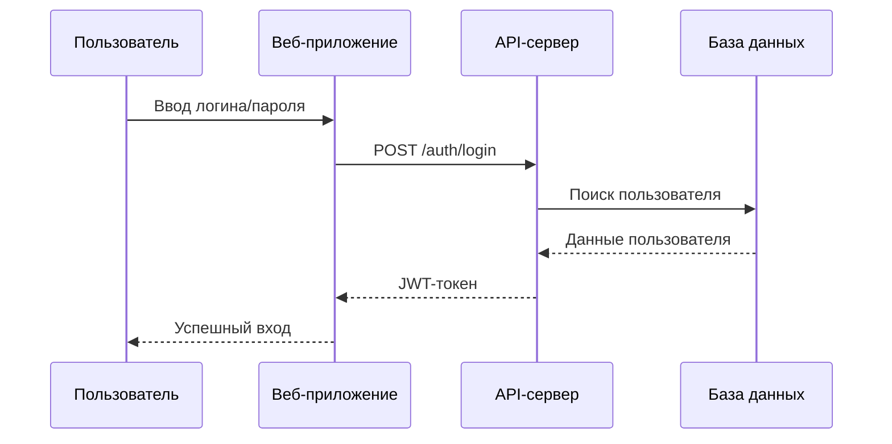
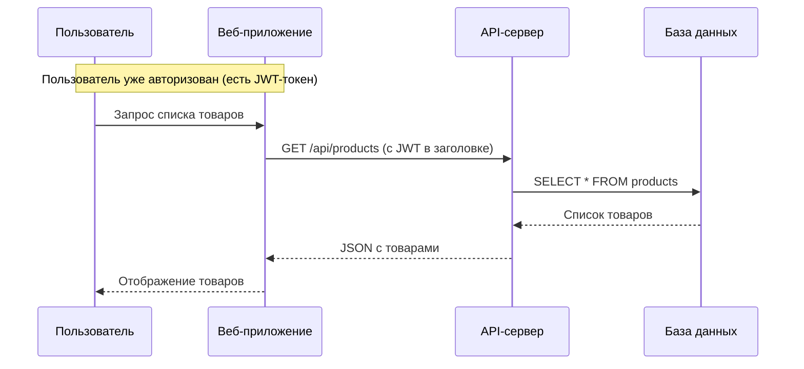

## Схемы взаимодействия фронтенда и бэкенда

Вот два варианта, как это можно оформить:

## **Вариант 1: Две независимые диаграммы**

### **Диаграмма 1: Процесс аутентификации (вход в систему)**





### **Диаграмма 2: Процесс получения данных (список товаров)**





------

## **Вариант 2: Одна диаграмма, но с четким разделением (альтернативный вид)**

Если нужна одна диаграмма, но без "повтора" колонок, можно использовать **рамки (fragments)**:

```mermaid
sequenceDiagram
participant U as Пользователь
participant W as Веб-приложение
participant A as API-сервер
participant D as База данных

rect rgb(240, 240, 255)
note right of U: Сценарий 1: Аутентификация
U->>W: Ввод логина/пароля
W->>A: POST /auth/login
A->>D: Поиск пользователя
D-->>A: Данные пользователя
A-->>W: JWT-токен
W-->>U: Успешный вход
end

rect rgb(255, 240, 240)
note right of U: Сценарий 2: Получение товаров
U->>W: Запрос списка товаров
W->>A: GET /api/products
A->>D: SELECT * FROM products
D-->>A: Список товаров
A-->>W: JSON с товарами
W-->>U: Отображение товаров
end
```





Такой вариант визуально разделяет сценарии цветом и подписями, и не нужно повторять участников.

------

## **Какой вариант лучше?**

| Критерий             | Две диаграммы                         | Одна с рамками                              |
| -------------------- | ------------------------------------- | ------------------------------------------- |
| **Наглядность**      | ⭐⭐⭐ Лучше                             | ⭐⭐ Хорошо                                   |
| **Для документации** | ⭐⭐⭐ Удобно вставлять в разные разделы | ⭐⭐ Приходится объяснять рамки               |
| **Для обучения**     | ⭐⭐⭐ Проще для новичков                | ⭐⭐ Может сбивать с толку                    |
| **Показать связь**   | ⭐⭐ Нужно пояснять, что это подряд     | ⭐⭐⭐ Видно, что сценарии идут друг за другом |

**Мой совет:** Если вы готовите материал для обучения новичков — используйте **две отдельные диаграммы** (Вариант 1). Так точно никто не запутается.


---


Вот подробное объяснение действий, выполняемых на данной диаграмме, разбитое по шагам и действующим лицам:

------

### **📊 Объяснение диаграммы последовательности (Sequence Diagram)**

Данная диаграмма описывает типичный процесс авторизации пользователя и  последующего получения данных в веб-приложении. В ней участвуют четыре  основных компонента: **Пользователь**, **Веб-приложение (интерфейс)**, **API-сервер (бэкенд)** и **База данных (БД)**.

Процесс разделен на два ключевых этапа: **Аутентификация (вход)** и **Загрузка данных (товаров)**.

------

### **🔐 Часть 1: Процесс аутентификации (Авторизация)**

Здесь пользователь доказывает системе, что он тот, за кого себя выдает.

- **`U->>W: Ввод логина/пароля`**
  - Пользователь (U) заходит на сайт или в приложение (W) и вводит свои учетные данные (например, email и пароль) в форму входа.
  - *Действие в реальности:* Пользователь заполняет поля и нажимает кнопку «Войти».
- **`W->>A: POST /auth/login`**
  - Веб-приложение (W) отправляет введенные данные на сервер. Это делается через HTTP-запрос методом `POST` на специальный адрес (эндпоинт) `/auth/login`.
  - *Технически:* Браузер отправляет запрос на бэкенд, передавая логин и пароль (обычно в теле запроса).
- **`A->>D: Поиск пользователя`**
  - API-сервер (A) получает данные и понимает: нужно проверить, существует ли такой  пользователь. Сервер формирует запрос к базе данных (D).
  - *Технически:* Это SQL-запрос типа `SELECT * FROM users WHERE email = '...'`.
- **`D-->>A: Данные пользователя`**
  - База данных (D) ищет запись. Если пользователь найден, она возвращает его данные серверу (A) — хэш пароля, имя, ID и т.д.
  - *Важно:* Сам пароль в чистом виде не передается.
- **`A-->>W: JWT-токен`**
  - API-сервер (A) проверяет пароль. Если он верен, сервер создает специальный цифровой пропуск — **JWT-токен (JSON Web Token)**. Внутри этого токена "зашита" информация о пользователе (например, его ID).
  - Сервер отправляет этот токен обратно веб-приложению (W).
- **`W-->>U: Успешный вход`**
  - Веб-приложение получает токен, сохраняет его (например, в localStorage или cookie  браузера) и показывает пользователю сообщение, что вход выполнен.  Пользователя перенаправляет в личный кабинет или на главную страницу.
- **`note over U,W: Инициируем сессию`**
  - Пояснение на диаграмме: с этого момента между пользователем и приложением  устанавливается сессия. Теперь при каждом следующем запросе  веб-приложение будет прикреплять сохраненный JWT-токен, чтобы сервер  понимал, что запрос идет от авторизованного пользователя.

------

### **📦 Часть 2: Работа с данными (Загрузка товаров)**

Теперь, когда пользователь вошел в систему, он хочет посмотреть товары.

- **`U->>W: Запрос списка товаров`**
  - Пользователь (U) переходит на страницу каталога или нажимает кнопку "Показать товары" в интерфейсе веб-приложения (W).
- **`W->>A: GET /api/products`**
  - Веб-приложение (W) отправляет запрос на сервер (A), чтобы получить данные. Это HTTP-запрос методом `GET` на эндпоинт `/api/products`.
  - Вместе с этим запросом приложение автоматически отправляет тот самый JWT-токен (в заголовке Authorization), чтобы сервер понял, что пользователь имеет право видеть товары.
- **`A->>D: SELECT \* FROM products`**
  - API-сервер (A) проверяет токен (валиден ли он, не истек ли) и, убедившись в правах пользователя, обращается к базе данных (D) за списком товаров.
  - *Технически:* Выполняется SQL-запрос `SELECT * FROM products` (выбрать все записи из таблицы товаров). Запрос может быть сложнее (с  фильтрацией, сортировкой), но для примера показан простой вариант.
- **`D-->>A: Список товаров`**
  - База данных (D) находит все записи товаров и отправляет их обратно на сервер (A).
- **`A-->>W: JSON с товарами`**
  - API-сервер (A) упаковывает полученные данные в удобный для передачи формат — JSON  (JavaScript Object Notation) — и отправляет их обратно веб-приложению  (W).
- **`W-->>U: Отображение товаров на странице`**
  - Веб-приложение (W) получает JSON с данными о товарах (названия, цены, картинки) и  отрисовывает их в браузере пользователя в виде красивой карточки или  списка.
- **`note over U,W: Выполняем действие - задание ии напиши объяснение действий выполняемых по этой диаграмме`**
  - Это, судя по тексту, ваша заметка или комментарий к диаграмме, означающая,  что весь описанный выше процесс и есть то самое действие, которое  требовалось объяснить.

### **Итог**

Диаграмма наглядно показывает стандартную схему взаимодействия фронтенда (то, что видит пользователь) и бэкенда (логика и данные) в современных  веб-приложениях.


---

---


**Рассмотрим если на диаграмме  последовательности изображены не две отдельные диаграммы, а два  последовательных сценария (сценарий входа и сценарий получения товаров)  на одной временной шкале.**

Теперь давайте разберем подробно, как это работает.

------

### Что означают колонки (U, W, A, D)?

Верхняя строка (`U W A D`) — это не заголовки двух разных диаграмм, а названия **«дорожеек жизни» (Lifelines)** участников системы.

- **U** (Пользователь)
- **W** (Веб-приложение)
- **A** (API-сервер)
- **D** (База данных)

В начале диаграммы мы объявляем всех участников, которые будут взаимодействовать на протяжении **всего времени**. Они просто перечислены в ряд для красоты и порядка.

------

### Почему они повторяются?

Потому что время на диаграмме течет **сверху вниз**. Когда мы дошли до конца первого сценария (логин), время не  остановилось. Пользователь продолжает сидеть в приложении и решает  посмотреть товары.

Стрелки, идущие от новых колонок `U W A D` внизу, **продолжают** те же самые линии жизни, которые были объявлены вверху.

Проще говоря, если бы мы растянули эти линии в длинные вертикальные полосы, они бы выглядели так:

text

```
U - линия жизни Пользователя тянется вниз через всю схему
|   W - линия жизни Веб-приложения тянется вниз через всю схему
|   |   A - линия жизни API тянется вниз
|   |   |   D - линия жизни Базы данных тянется вниз
|   |   |   |
|   |   |   |
U   W   A   D  (Это просто визуальное "перечисление" участников в начале)
|   |   |   |
[ Происходит процесс ЛОГИНА ]
|   |   |   |
U   W   A   D  (Мы просто "напоминаем" читателю схему, перед новым действием)
|   |   |   |
[ Происходит процесс ПОЛУЧЕНИЯ ТОВАРОВ ]
|   |   |   |
U   W   A   D  (Конец)
```


------

### Визуальная аналогия

Представьте себе график отпусков на работе. Вверху написаны имена сотрудников: `Петя | Вася | Маша`. Ниже для каждого месяца мы снова пишем эти имена, чтобы было понятно, чей график мы сейчас смотрим.

На диаграмме последовательности то же самое: верхний ряд `U W A D` — это «шапка таблицы». А нижний ряд `U W A D` — это «повтор шапки» перед новым важным блоком действий (в данном  случае перед запросом товаров), чтобы визуально отделить один сценарий  от другого и не путаться в длинных линиях.

### Итог

Это **одна диаграмма**, показывающая **два события**, идущих друг за другом во времени.

1. **Сначала** колонки `U W A D` участвуют в логине.
2. **Потом** те же самые колонки (те же самые объекты) участвуют в загрузке товаров.

Повторная запись `U W A D` в середине — это просто удобный способ «перезапустить» взгляд читателя и сказать: «А теперь, внимание, новый сценарий с теми же участниками!».

